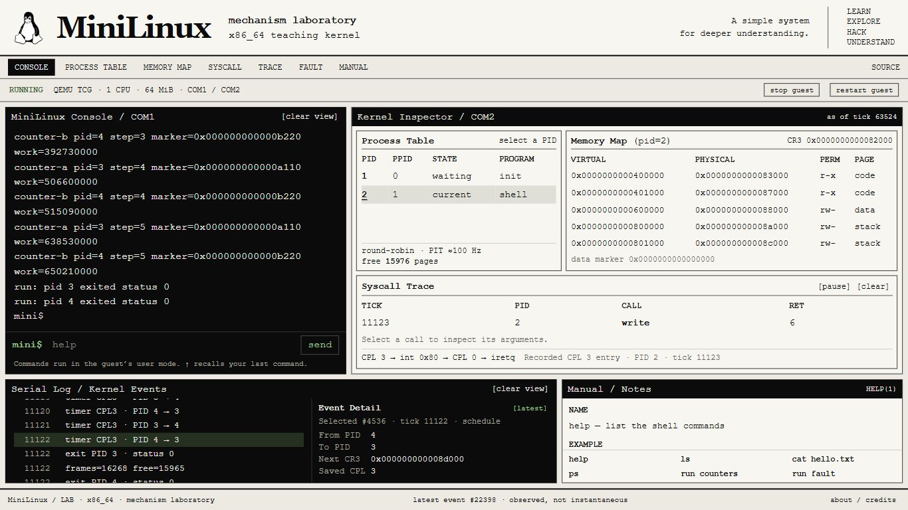

# MiniLinux

MiniLinux 是一个以 C 为主实现的教学操作系统，回答一个问题：**一个用户程序怎样获得内存和 CPU 时间，又怎样经内核入口读到文件里的字节？** 名字中的 Linux 表示学习对象与风格；本项目没有使用 Linux 内核源码，不是 Linux 发行版、fork 或兼容实现。

当前候选已完成 M0–M6 教学闭环：两个真正的用户态程序实例被时钟抢占，使用各自地址空间，经 syscall 读出 RamFS 字节，核对后输出；故障只停止指定实例，另一个继续完成。本机完整回归与 GitHub 精确提交干净克隆都已通过，候选位于 [PR #1](https://github.com/NoctilumeDev/MiniLinux/pull/1)，尚未合入主线。坐标和范围见 [闭环记录](docs/CLOSURE.md)。

随后从 xv6、SerenityOS、Linux 的修复和入口机制学习错题，新增反例发现并修补了上层页表权限遗漏、非页错误用户异常停止整个实验这两类裂缝。修补提交 `ae93e86` 的 M0–M6 与新增反例已从 GitHub 干净克隆重跑通过，首败和夹具错误分别保留在 [错题本](docs/COUNTEREXAMPLES.md)。

```text
Limine → kernel_main → 物理页 → 四级页表 → PIT/中断 → 数组轮转
                                                 ↓
                       CPL3 用户程序 ← iretq / TSS 内核栈
                              ↓ int 0x80
                       open / read / close → RamFS 字节
                              ↓ 返回 RAX 与输出区
                       用户逐字节核对 → 串口输出
```

M0–M6 保留固定内嵌程序的两个实例和实验完成后的 intentional stop。其上新增独立 `LAB` 模式：真正的用户态 init/shell 创建、等待演示程序，再用浏览器连接同一台 QEMU 的输入输出与机制记录。没有任意 ELF 加载器。网络、磁盘恢复、SMP、客体 GUI、完整 POSIX、动态链接和生产 hardening 都不在目标内。



## 操作这个系统

已经准备好 M0 固定工具的 Windows PowerShell 中运行：

```powershell
.\tools\lab.ps1
```

打开 <http://127.0.0.1:8080/>。先输入 `help`，再试 `cat hello.txt`、`run reader`、`run counter-a counter-b`、`run fault`。前端发送实际串口输入；命令在 CPL3 shell 执行。右侧的 PID、CR3、地址映射、时钟切换和 syscall 来自 COM2，不是 JavaScript 模拟。

```text
PID 1 / init → PID 2 / shell → spawn → 用户程序
                                       ↓ timer / syscall
                           私有地址空间、CPU 时间、RamFS
                                       ↓ exit / wait
                           回收用户页 → shell 继续接受输入
```

黑白页面以终端、观察窗、日志和手册为主体。桌面上方黑白宽度为 38.2:61.8，下方反转为 61.8:38.2；四个外框、输入和页脚共同适应一个浏览器视口，整页不需要上下滚动。长记录与手册在各自框内滚动，保留可读字号；窄窗口改为上下排列的长页面。浏览器是宿主观察工具，MiniLinux 客体仍是串口系统。

日志左侧是时间线，右侧显示选中记录的字段：调度的 PID/CR3/CPL、故障的地址/RIP/错误码等。点击记录可保持这次观察，点击 `latest` 恢复跟随；这是一条已记录事件的详情，不是当前 CPU 的即时状态。

在线 demo 已选定为真实运行记录的交互回放，会明确标注 `REPLAY`；Windows 下载版则运行真实 QEMU 客体。两项体验入口仍在准备，发布并验证后再加入链接。当前先使用上面的本机入口。

`LAB` 上层和宿主桥接的自动验证入口是 `./tools/check-lab.ps1`。请先停止当前预览再验证，以免同时改写同一构建目录、镜像和记录。本轮受测源码 `ac3e5cb` 已从 GitHub 干净克隆重跑所有入口，候选位于 [PR #2](https://github.com/NoctilumeDev/MiniLinux/pull/2)，基于尚未合入的 PR #1。薄用户态的证明、首败与限制见 [USERLAND](docs/USERLAND.md)，视觉和浏览器验证见 [design-qa](design-qa.md)。

## 里程碑

| 里程碑 | 教学问题 | 实际证明 | 候选状态 |
| --- | --- | --- | --- |
| M0 实验台 | 怎样从精确源码进入 C，失败后重新接管？ | ELF/ISO 载荷、串口、GDB 与有界失败；历史基线固定在 [m0-windows-bios-qemu](https://github.com/NoctilumeDev/MiniLinux/tree/m0-windows-bios-qemu)。 | 已验证；[历史记录](docs/M0-remote-round-record.md) |
| M1 物理页 | 内核凭什么认定一页内存可用？ | USABLE 分配、保留区拒绝、耗尽与复用，整页读写和计数恢复。 | 本机通过；[记录](docs/M1.md) |
| M2 地址映射 | 虚拟地址怎样落到物理页？ | 实际更换 CR3，别名写入与物理读回，取消/重映射和回收。 | 本机通过；[记录](docs/M2.md) |
| M3 CPU 时间 | 两个 task 为什么都能运行？ | PIT 打断不 yield 的计算，保存/恢复上下文；故意改坏 R12 被拒绝。 | 本机通过；[记录](docs/M3.md) |
| M4 用户边界 | 用户怎样受控进入内核？ | 真正 CPL3、syscall 返回、非法指针拒绝，内核页保护异常后另一 task 继续。 | 本机通过；[记录](docs/M4.md) |
| M5 文件字节 | 文件内容怎样回到用户程序？ | 5+12 字节读取与用户核对，独立偏移、EOF、描述符和跨页拒绝。 | 本机通过；[记录](docs/M5.md) |
| M6 进程声明 | 相同虚拟地址能否存不同数据？ | 两个根与物理页、用户标记和物理读回，七种保护/异常探针、故意别名拒绝。 | 本轮补充及完整回归远端干净克隆通过；[记录](docs/M6.md) |

M5 关闭主教学问题，M6 证明并发与地址隔离后才升级 process 声明。每轮先写证明条件，再实现和验证；首败不被后来通过覆盖。没有照着 Linux/xv6 的模块清单扩张，也不把不同阶段的绿色输出混成一次资格。

当前候选的全部里程碑都已从同机 GitHub 干净克隆重跑，表中的“本机通过”不是另一台机器的资格。主线合入状态与运行资格分别记录，M0 历史标签保持原坐标。

## 运行

源码位于 [NoctilumeDev/MiniLinux](https://github.com/NoctilumeDev/MiniLinux)。本机工作区在 `C:\Users\lenovo\Desktop\GitHubProjects\MiniLinux`，固定工具和镜像在 `D:\DevTools\MiniLinux`。PowerShell 中运行完整闭环：

```powershell
cd C:\Users\lenovo\Desktop\GitHubProjects\MiniLinux
.\tools\closed-loop.ps1
```

只看最终机制可以用 `./tools/stage.ps1 -Milestone M6`。逐轮可以用 `tools/m0.ps1`、`tools/m1.ps1` 或 `tools/stage.ps1 -Milestone M2` 至 `M6`。构建和客体串行运行，单核 QEMU 使用 64/256 MiB。`LAB` 默认客体 64 MiB，另固定 32 MiB TCG 翻译缓存；宿主开销与客体内存分别记录，Codex、浏览器和其他应用另计，见 [运行范围](docs/USERLAND.md#运行范围)。

从外部错题迁移回来的攻击实验使用 `./tools/counterexamples.ps1`，包含耗尽、权限、指针、异常和入口现场；首败保留，不与夹具设置失败混算。

每轮重建 `build/kernel.elf`，生成 D 盘对应 ISO 并核对载荷；不要拿另一轮或另一目录的旧 ISO 配当前 ELF。构建默认参数仍为 M0，以保留原实验入口。最终输出包含：

```text
hello from ramfs
user page fault: task=0 vector=14 error=0x0000000000000005 ...
task stopped: 0
user report accepted: 1
M6 isolated VA 0x0000000000600000 ... marker=0x000000000000a110 ...
M6 isolated VA 0x0000000000600000 ... marker=0x000000000000a111 ...
MiniLinux M6: process isolation checks passed
```

## 写法与依赖

**能直写就直写，教学之外复用工具，教学之内亲手实现机制。** 普通字节状态数组、固定 task/文件槽数组、循环和 switch 就够了。页表位与 CPU 入口按硬件规则表达；少量汇编负责端口、控制寄存器、中断现场和 `iretq`，不把调度或文件规则藏在技巧里。

内核与用户程序没有 libc、第三方运行库或外部内核组件依赖。`memset`/`memcpy` 是自己的逐字节实现；链接使用 `-nostdlib -static`，完整验证拒绝未解析符号和动态运行库段。浏览器页面使用原生 HTML/CSS/JavaScript，宿主桥接只用 Python 标准库，无新增 npm/Python 包。整个实验工具链仍依赖 Clang/LLD、Limine、QEMU/GDB、Python/pycdlib；不能把这些启动与宿主依赖说成不存在。

建议先读 [顺着程序读代码](docs/WALKTHROUGH.md)，再看每轮记录与 [闭环坐标](docs/CLOSURE.md)。工具版本和安装路径见 [M0 环境](docs/M0.md)；首败和接管的历史见 [M0 轮次](docs/M0-round-record.md)、[复审](docs/M0-re-audit.md)。Limine 协议头文件保留原有 0BSD 许可，外部源码用于核对机制和学习错题，没有复制外部内核实现。
